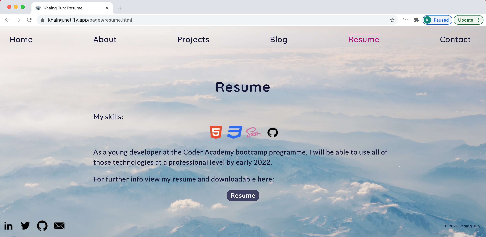
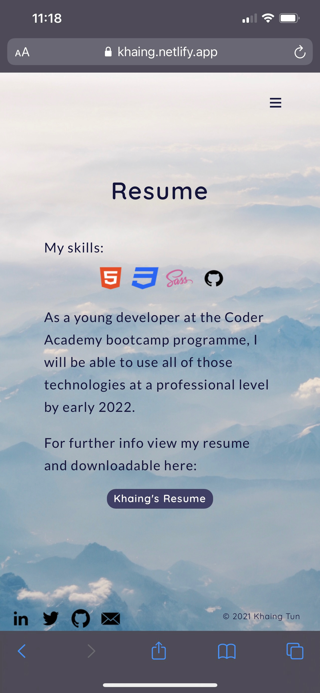

# My Portfolio Website

The website is viewable online [here](https://khaing.netlify.app/).

The GitHub repository can be viewed [here](https://github.com/khaingtt/kportfolio).

## **Purpose**

This portfolio website is for an assigment submission for _INT1012 - Introduction to Web_ at **Coder Academy**. 

## **Functionality and features of Portfolio**

### **Overview**

The site consists of 12 pages in total, which includes Home, About, Projects , Blog , Resume and Contact.

### **Components**

* The site has two parts that links to social media and the main menu. The common _**navigation bar**_  presents on all the pages. For the mobile view the main menu collapses into a hamburger menu icon and a drop down menu.
* Every pages include _**footer**_ with the copyright statement.
* The _**"quick link"**_ buttons, the viewer to the contact or project pages where appropriate.
* Graphic content is represented by the _**icons**_ (socials icons in the navbar, tech icons on the resume and project pages) and _**images**_ (on the About page, Projects, Blog, Blog posts).
* Projects and Blog pages have a common theme of _**"preview cards"**_, the separate box that includes images, text, header, links.
* Blog post pages share a component of a _**blog navbar**_, which includes left and right arrows and "back to blog" button.
* Finally, the contact page contains the _**form**_ with text name fields, email address bar, text area for the message and submit button.

## Target audience

This website is for my teachers, classmates and personal improvement in coding skills.

## List of used Tech stack

* _Planning:_ Trello
* _Designing:_ Balsamiq Wireframes
* _Code editor:_ VSCode
* _Coding method:_ HTML/SCC, SASS
* _Verstion control:_ GitHub
* _Form functionality:_ Formspree
* _Deployment:_ Netlify

## Screenshots List

### Trello Board work in progress

### Mockups

Wireframes pages 
 
page2 
 

### Desktop

Landing page 
 
About 
 
Projects 
 
Blog 
 
Blog Post 
 
Resume 
 
Contact 
 

### Mobile

Landing page 
 
About 
 
Projects 
 
Blog 
 
Blog Post 
 
Resume 
 
Contact 
 
